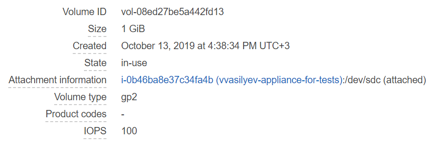
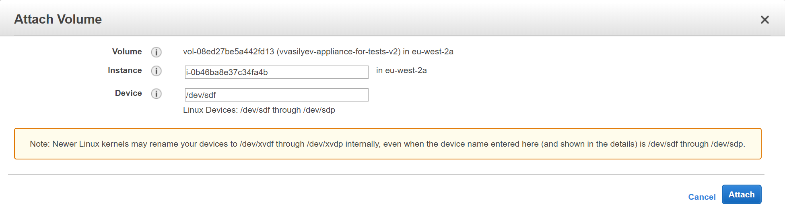
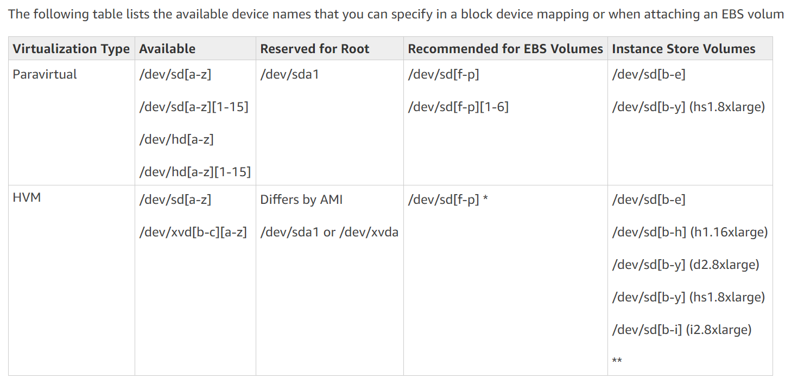
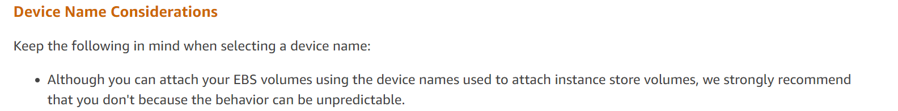

# TODO:

- отредактировать текст статьи (убрать лишние разговорные конструкции, использовать аналогии);
- добавить примеры кода (может и не надо);
- перевести статью на английский;
- ещё раз прочитать, убедиться в отсутствии опечаток/ошибок;
- опубликовать текст на `dev.to` (или другом ресурсе, на котором я буду вести блог).

# AWS mount point issue

Часто ли у Вас бывают такие моменты в работе, когда сталкиваешься с сложной проблемой и вообще не знаешь, как её решить?
Нет никаких предположений, откуда эта проблема взялась.
Никаких зацепок.
Только стектрейс, последовательность действий для воспроизведения проблемы и монитор с клавиатурой.

Недавно в одном из рабочих проектов, связанным с Amazon Web Services я столкнулся с проблемой такого рода.
О том, как всё-таки удалось эту проблему решить, и будет посвящена эта статья.

Сразу предупрежу, что статья будет содержать детали и нюансы работы с AWS, конкретно с EC2 частью.
Если вы не знакомы с платформой AWS, то вряд ли эта статья вам будет интересна.

Table of Contents:

- [Task description](#task-description)
- [Unexpected behavior](#unexpected-behavior)
- [Dig deeper](#dig-deeper)
- [Need more research](#need-more-research)
- [Final solution](#final-solution)
- [Conclusion](#conclusion)
- [Links](#links)

## Task description

Прежде, чем перейти к проблеме, опишу задачу, в которой она возникла.
Один из компонентов нашего сервиса взаимодействовал с AWS EC2 через [API](https://docs.aws.amazon.com/AWSEC2/latest/APIReference/Welcome.html).
Он создавал EC2 инстансы и EC2 диски по спецификации, а после прикреплял диски к инстансу.
Спецификацию можно создать по уже существующим EC2 инстансам пользователя в AWS EC2.

Для того, чтобы прикрепить диск к определённому инстансу, достаточно нужно указать 3 значения:

- ID диска в EC2;
- ID инстанса в EC2;
- Device name, к которому нужно диск присоединить.

Сам метод можно изучить более подробно [в документации](https://docs.aws.amazon.com/AWSEC2/latest/APIReference/API_AttachVolume.html).

Стоит отдельно отметить, что при создании инстанса в AWS также создаётся как минимум 1 диск (системный).
Но для наших целей он был не нужен, поэтому за счёт дополнительных вызовов API компонент откреплял его и удалял.

Задача не кажется сложной, в коде тоже всё выглядит достаточно просто, поскольку вся основная логика сводится к вызову нужных методов из [AWS EC2 API](https://docs.aws.amazon.com/AWSEC2/latest/APIReference/Welcome.html).

Как в такой простой задаче может возникнуть серьёзная проблема, которая может поставить в тупик?
Как оказалось, может.

## Unexpected behavior

Во время одного из запусков сервиса у меня почему-то не создался EC2 инстанс, как я ожидал.
Тот самый компонент не смог прикрепить созданные EC2 диски к созданному EC2 инстансу, потому что указанные mount point был уже занят.

Сама по себе такая ошибка уже странная, поскольку на этапе прикрепления EC2 дисков к EC2 инстансу, как отмечалось ранее, инстанс **НЕ имеет никаких дисков**.
Вообще (см. примечание в предыдущем разделе).

Ситуацию усуглял тот факт, что эта проблема воспроизводилась только при работе с EC2 инстансами с Linux образом.
Причём *не со всеми* образами, а с узким набором Linux образов.

## Dig deeper

После детального разбора кода компонента из сервиса, я убедился в том, что вся логика по работе с оборудованием в AWS EC2 прописана корректно.
Остаётся, что проблема может быть только на стороне AWS.

Изучив документацию AWS EC2, я не нашёл ничего, что помогло бы приблизиться к решению проблемы.

Следующим шагом стало углубление в детали конфигураций EC2 инстанса и EC2 дисков, а также к каким device name они присоединяются.
Меня привлёк тот факт, что EC2 диск прикреплялся к `/dev/sdc`, хотя в AWS EC2 UI при ручном прикреплении дисков на том же EC2 инстансе всё прошло **успешно**:

Почему я обратил на это внимание? Потому, что шагом ранее при присоединении диска в AWS EC2 UI вы можете увидеть такое окно:

Обратите внимание на небольшую заметку для Linux Devices.
Там указано, что для Linux Devices нужно использовать я device names в диапозоне `/dev/sdf` – `/dev/sdp`. 

Вот это поворот!
Но почему AWS всё равно разрешает пользователю вручную присоединять диски к device names вне указанного диапозона?
Тем более почему *аналогичные* вызовы через API **не завершаются успешно**?
На эти вопросы я не нашёл ответа.

Однако факт остаётся фактом: пользователь может прикрепить EC2 диск к *некорректным* device names EC2 инстанса, а нашей компоненте нужно уметь такие конфигурации обрабатывать.
Т.е. если пользователь создаст спецификацию по EC2 инстансу с такой конфигурацией, то компонента по ней должна уметь создавать аналогичный инстанс в AWS EC2.

## Need more research

Хорошо погуглив, я нашёл что-то связанное с указанной проблемой в [этом вопросе](https://serverfault.com/questions/505460/some-ebs-devices-have-issues-with-ec2-attach-volume) на StackExchange.
В нём человек также столкнулся с аналогичным поведением AWS EC2.
Там же была дана [ссылка](https://docs.aws.amazon.com/AWSEC2/latest/UserGuide/ebs-attaching-volume.html) на документацию процедуры прикрепления дисков AWS EC2 для пользователя (не через вызовы API).

Изучив эту страницу, я приметил другую [ссылку](https://docs.aws.amazon.com/AWSEC2/latest/UserGuide/device_naming.html) на детали device naming on Linux Instnaces.
В указанной статье расписано про некоторые нюансы device naming в определённых случаях. Можно увидеть такую таблицу с available device names:

А чуть ниже в разделе **Device Naming Considerations** как раз находится ответ на описываемую в этой статье проблему:

Оказывается, что некоторые образы имеют зарезервированные device names для Instance Store Volumes.
И вы **можете** попытаться использовать эти зарезервированные device names.
Однако, **поведение AWS EC2 непредсказуемо** в таких случаях!

Супер!

## Final solution

Как я уже упоминал ранее, независимо от поведения AWS EC2, наш компонент должен уметь работать с такими EC2 инстансами.
Поскольку я никак не мог повлиять на поведение AWS EC2 или исправить его, было решено сделать обходное решение для данной проблемы.

Теперь если компонент получает ошибку при неудаче присоединения EC2 диска, то он узнаёт доступные у EC2 инстанса device names и пробует присоединить диск к device names из *разрешённого* диапозона в документации AWS EC2.
Конечно, пользователь получит уведомление о том, что итоговая конфигурация созданного инстанса с дисками в EC2 будет отличаться от заданной.
Что поделать, это меньшее зло, на которое мы решились.

Зато пользователь получит свой EC2 инстанс, хоть и не совсем в той конфигурации.

## Conclusion

Если когда-нибудь в жизни вы будете разрабатывать API для своего сервиса, не делайте таких **непредсказуемых** и **непостоянных** вещей.
Все действия и методы должны быть понятными и хорошо задокументированными.

Всё написанное в этой статье никак не умоляет того, что [AWS EC2 API]((https://docs.aws.amazon.com/AWSEC2/latest/APIReference/Welcome.html)) очень подробно и хорошо задокументировано.
Даже эта проблема указана, хоть и в одном примечании и косвенно.

Но подобное непоследовательное поведение, которое отличается в двух аналогичных ситуациях (при использовании AWS EC2 UI и AWS EC2 API), часто приводит к запутанным проблемам, которые ставят в тупик и требуют глубокого исследования.

Хотелось бы, чтобы в жизни разработчиков такие *замечательные* проблемы встречались как можно реже.
Спасибо за прочтение статьи!

## Links

- [AWS EC2 API](https://docs.aws.amazon.com/AWSEC2/latest/APIReference/Welcome.html)
- [Question on StackExchange about issues with EC2 attaching volume](https://serverfault.com/questions/505460/some-ebs-devices-have-issues-with-ec2-attach-volume)
- [Attaching an Amazon EBS Volume to an Instance (AWS documentation)](https://docs.aws.amazon.com/AWSEC2/latest/UserGuide/ebs-attaching-volume.html)
- [Device Naming on Linux Instances](https://docs.aws.amazon.com/AWSEC2/latest/UserGuide/device_naming.html)
